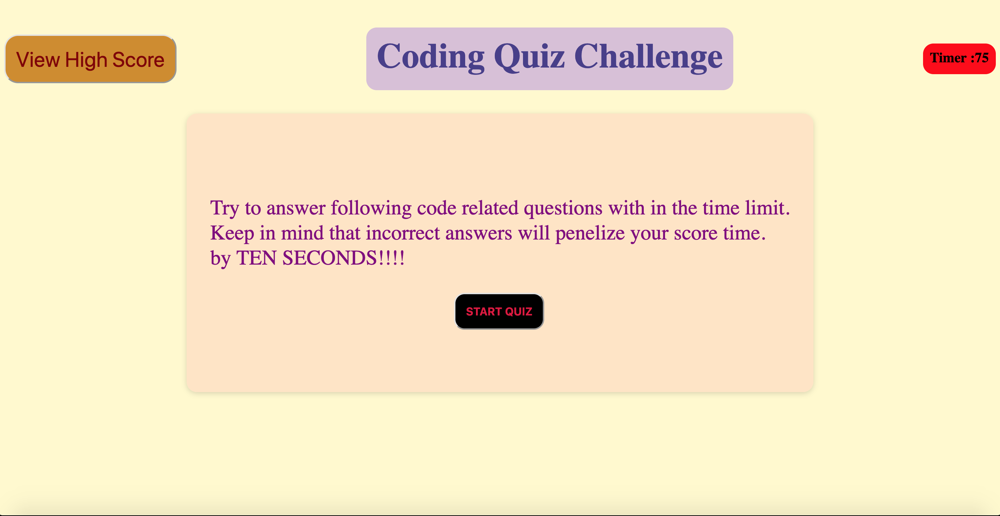

# Code-knowledge-test
Code quiz , challenge homework 4 using Web API's.

Building  a timed coding quiz with multiple-choice questions. This app will run in the browser and will feature dynamically updated HTML and CSS powered by JavaScript code.It will have a clean, polished, and responsive user interface.

## User Story

AS A coding boot camp student
I WANT to take a timed quiz on JavaScript fundamentals that stores high scores
SO THAT I can gauge my progress compared to my peers.

## Acceptance Criteria

GIVEN I am taking a code quiz
WHEN I click the start button
THEN a timer starts and I am presented with a question
WHEN I answer a question
THEN I am presented with another question
WHEN I answer a question incorrectly
THEN time is subtracted from the clock
WHEN all questions are answered or the timer reaches 0
THEN the game is over
WHEN the game is over
THEN I can save my initials and my score.

## Mock-Up

The following animation demonstrates the application functionality:

## Screen Shot 

## Discription of the Challenge: Code Knowledge Test

1. Initally commited codes for basic HTML and CSS. 
2. started coding in javascript for the funcion of the code test page to satisfy the  acceptence criteria for the challenge needed.
3. when clicked on startquiz button startQuiz() runs.
4. At the same time timer starts counting with startTimer()  which is set to 75secs and displays questions with  answer choices with loadNextQuestion().
5. Each question is displayed with unique id and answer choices which is button. 
6. When clicked on one the answer choices it compares the answer with the question array questionList=[] and displays answer is CORRECT! or WRONG!.
7. If answer is correct it adds +20 score points for each correct answer and loads next question.
8. If answer is wrong it deducts 10 seconds from timer countdown.
9. when all the questions are done timer stops and displays submitform showing finalscore and text input for name initials.
10. If all the questions are not answered and timer is 0 then the game will be over and displays submitform.
11. In the submitForm page when initial is input  and clicked submit button, it loads HighScore page with loadViewHighScore() and along with it the initials and particular finalscore is saved and stored in the localstoage. This is done using localStotage.setItem().
12. when HighScore page is loaded it gets initials and finalscore from the local storage using localStorage.getItems() and displays as a list in the page. It also have GoBack and ClearHighScore buttons.
13. When clicked on the Goback button it reloads the home page to start a new game.
14. When clicked on the ClearHighScore button it clears all the list of initials and scores in the Highscore page and also clears in localstorage.
15. there is a View High Score button on the left end of the home page when it is clicked anytime it loads HighScore page.
16. Finally deployed the application.
